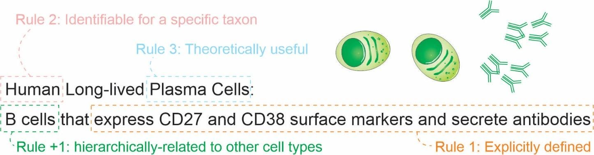

# 1. A set of 3 + 1 rules for defining a cell type

Our pragmatic definition of cell type (for eukaryotic, multicellular organisms) consists of 3 + 1 simple rules (Figure @fig:rules).
A cell type is a class of cells that must be:

1. Explicitly defined
2. Identifiable for a defined taxon
3. Theoretically useful 

And that should be:

4. Hierarchically related to other cell types

{#fig:rules}

Here, “must” represents an absolute requirement, whereas “should” suggests that “there may exist valid reasons in particular circumstances to ignore a particular item” (as per RFC 2119 [@wikidata:Q104060055]).

For rule 1, we mean that the cell type needs to be followed by a clear definition that would allow rational judgments of whether a singular cell belongs to the type or not.
Such definitions should provide necessary and sufficient criteria for classification. An example is a cell type defined by “expression of the proteins CD3 and CD4, but lacking CD8.”
Even though there is still some ambiguity (see [@doi:10.1186/s12859-019-2725-5; @doi:10.1093/bioinformatics/btu807] for longer discussions), it already states clear and reasonable criteria.
The degree of rigorousness cannot be decided a priori, as we still do not have a rigorous framework for representing biological knowledge, but we should strive to make definitions as rigorous as possible.
Other examples of what could be explicit definitions are as follows:

- “Big cell” is a class of cells that have a length of more than 50 micrometers on any axis.
- “Human cortical neuron” is a class of cells in human cortex that are capable of producing an action potential.
- “Leukocyte” is a class of cells found in animal blood which are achromatic cells.

The recognition of multiple valid characteristics to define types is not new.
The first Cell Ontology article, in 2005, explicitly acknowledged criteria based on function, histology, lineage, and ploidy.[@wikidata:Q21184168]
These features were combined in the definitions of “species-neutral” cell types[@doi:10.1186/s13326-016-0088-7], arguably useful for integrating databases or for teaching biology.
Gradually, we are acknowledging that we might need more specific classes to characterize experimental biology, leading to the definition of species-specific types defined by granular characteristics. [@doi:10.1186/s12859-017-1980-6; @doi:10.1186/1471-2105-12-6]. 

Rule 2 is an explicit criterion that must be followed while discussing cell types scientifically; we need to define the taxa for which a given cell type is expected to manifest.
The cell type then needs to be discoverable in any individual of the taxon (or taxa) of interest, given the appropriate conditions (e.g., stage of life and biological sex). 
The set of taxa covered by a cell type is called here a taxonomic scope (or just scope) of the cell type.
Note that, as cell types can be defined by function and functions can converge, the taxonomic scope is not restricted to monophyletic taxa (clades).
The definition of taxon used here is liberal and applies to any class of organisms that any researcher identifies explicitly as a unit.

Knowing the scope is important to avoid the pitfalls of extrapolation.
A recurrent theme is that theories corroborated by mouse experiments are valid for human cell types.
Such extrapolation is an instance of the classic problem of induction, which is discussed thoroughly in "The Logic of Scientific Discovery” [@wikidata:Q1868040].
The taxonomic scope allows us, researchers, to be clear regarding our claims, and better discern what we claim to be true for a strain, a species or any other class of organisms. 

Rule 3 deals with a practical concern.
Rigorously, there is an infinite number of explicit definitions that any scientist might come up with.
One simple proof of this infinitude is that size-based cell definitions (as for “big cell” above) may alone consider any of the infinite real numbers.
Thus, a cell type “bigger than 7.835 micrometers” might fit the first two rules, but will likely fail rule 3.
If we, as a research community, want to characterize all human cell types, it is necessary to have a finite number of cell types.
Rule 3 could be paraphrased as: a valid cell type is a class of cells that any researcher rationally finds useful for a theoretical perspective of reality.
For example, a recent study used single-cell RNA-seq experiments to assign 275,000 Drosophila cells into 200 cell types [@wikidata:Q101226729].
Since these 200 cell types were useful for Özel and colleagues when describing the world, they automatically satisfied rule 3. 

Rule 4 is a practical extension of the usefulness rule: a cell type has to be hierarchically-related to other cell types for increased usefulness.
This means that a definition of a cell class is (for research synthesis concerns) less useful if it cannot be considered a “subclass” of another cell type.
For practical concerns, all imaginable mammalian cell types are subclasses of a “eukaryotic cell” (defined as any cell of an eukaryotic organism) and likely can be subclasses of more specific cell types.
The rule 4 is presented as a recommendation instead of a requirement as, in practice, it might be an overhead and not strictly necessary for tasks like claiming the discovery of a new cell type.  

Ontological organization is important for integrating knowledge across studies.
A cell type that is based on its transcriptome is not the same as one based on its electrophysiology. 
They can, nevertheless, be connected by a superclass that matches either one or the other criterion. 
For example, the green-OFF bipolar cells of the retina and the Syt2-/NK3R+ cells of the retina are considered to be the same cell type [@wikidata:Q34307217].  
However, as these features are often measured separately, we have, in fact, two individual classes for which knowledge is produced. These classes, then, can be combined in the superclass “(green-OFF) OR (Syt2-/NK3R+) cells” for the integration of claims across domains. Practically, when describing a cell type, one should make an effort to insert it into the universe of interrelated cell types, even if that implies creating new superclasses.

The consequences of this set of criteria will be discussed further in the following sections. 