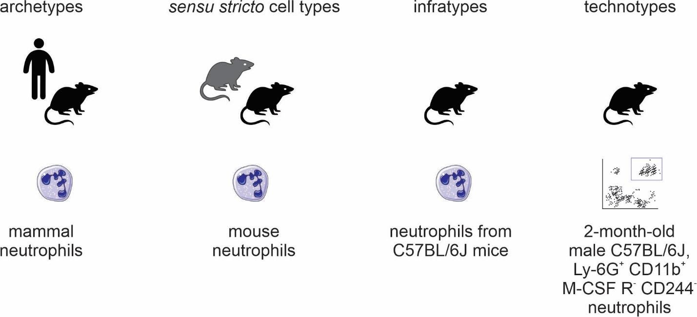

# Naming classes of cell types

To facilitate communication among life scientists, we propose a set of naming conventions for different classes of cell types. 
Much of the literature mix cell types in one species (e.g., when dealing with a cell type as an evolutionary unit) or in multispecies (e.g., in the Cell Ontology). 
It is arguably useful to distill these different concepts into their own names. Given the importance of the concept of species in biological classification [@url:http://phylonames.org/code/preface/], we derive a species-centric view on the naming of classes of cell types. 
The four classes (Figure @fig:classes) we propose are as follows:

- archetypes, for when the taxonomic scope of the type is beyond the level of species; for example, “mammal neutrophils.”
- _sensu stricto_ cell types, for when the taxonomic scope of the type corresponds to a single species; for example, _Mus musculus_ neutrophils.”
- infratypes, for when the taxonomic scope is below the level of species; for example, considering the mouse strain “C57BL/6J”, “neutrophils from C57BL/6J mice”. 
- technotype, for specific, experimentally defined cell types that harbor in their definition the precise conditions of the cells sampled; “2-month-old male C57BL/6J, Ly-6G+ CD11b+  M-CSF R-  CD244- neutrophils”.

{#fig:classes}

By adopting a precise vocabulary, we can avoid misunderstandings and communicate more clearly.
At the level of individual scientific experiments, scientists rarely reach the _sensu stricto_ cell type level; the samples come only from a subpopulation of the species of interest and cannot be assumed to be randomly sampled from all individuals of the species. 
This has important practical considerations to, once again, avoid failing implicitly at the problem of induction.

In addition, in individual experiments, we work with cells of very specific classes.
They are not only infratypes but very specific infratypes defined by non-random research setups and pragmatic choices. For example, we might call “CD4 T cells” what are actually CD3+, CD4+, CD8- cells from the axillary lymph node of 2-month-old chow-fed female C57BL6/J mice from the mouse-house of the Institute of Biochemistry of the University of São Paulo collected on several mornings around 10 pm.
Although quite specific, all the mentioned facets (markers, anatomical location, age, biological sex, strain, housing conditions, circadian clock, and diet) are known to alter what we know about cell types.
Thus, we benefit from using a name for the experimentally-constrained cell classes: technotypes.

Even if it is specific, a technotype is still a class. 
Unless a study used only one single-cell, it likely contained some sampling method. 
Samples are from a specific population for which hypotheses are actually tested. 
This is the most granular cell type, in our considered view, for research synthesis. 
This is the type that can be strictly annotated in single-cell RNA-seq datasets, for example.

Single claims are made and tested for technotypes, and the claims can be logically combined in “upper” ontological levels for reaching a higher degree of universality.
The propagation of knowledge to upper levels cannot be implicit (see Yarkoni 2020 for an analogous problem in the psychological sciences [@doi:10.31234/osf.io/jqw35]). 
As Popper defends, knowledge should travel “quasi-inductionally” by fostering hypotheses with higher degrees of generality, which can then be tested for the more universal class  [@wikidata:Q1868040]. 