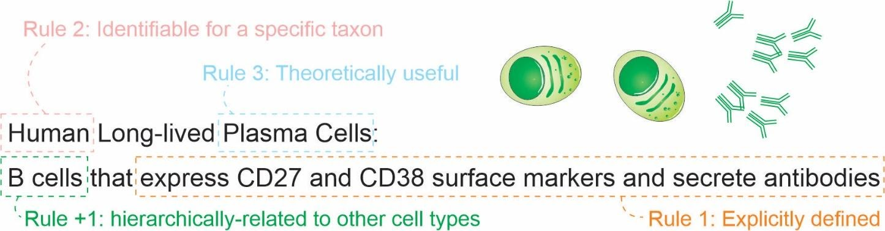
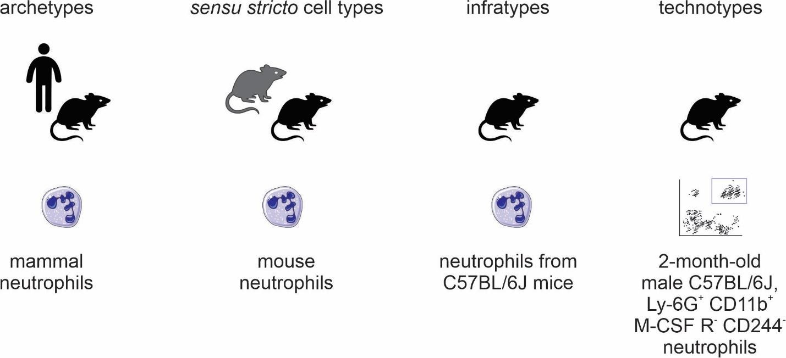

---
author-meta:
- Tiago Lubiana
- Helder I Nakaya
bibliography:
- content/manual-references.json
date-meta: '2020-12-26'
header-includes: "<!--\nManubot generated metadata rendered from header-includes-template.html.\nSuggest improvements at https://github.com/manubot/manubot/blob/master/manubot/process/header-includes-template.html\n-->\n<meta name=\"dc.format\" content=\"text/html\" />\n<meta name=\"dc.title\" content=\"Towards a pragmatic definition of cell type\" />\n<meta name=\"citation_title\" content=\"Towards a pragmatic definition of cell type\" />\n<meta property=\"og:title\" content=\"Towards a pragmatic definition of cell type\" />\n<meta property=\"twitter:title\" content=\"Towards a pragmatic definition of cell type\" />\n<meta name=\"dc.date\" content=\"2020-12-26\" />\n<meta name=\"citation_publication_date\" content=\"2020-12-26\" />\n<meta name=\"dc.language\" content=\"en-US\" />\n<meta name=\"citation_language\" content=\"en-US\" />\n<meta name=\"dc.relation.ispartof\" content=\"Manubot\" />\n<meta name=\"dc.publisher\" content=\"Manubot\" />\n<meta name=\"citation_journal_title\" content=\"Manubot\" />\n<meta name=\"citation_technical_report_institution\" content=\"Manubot\" />\n<meta name=\"citation_author\" content=\"Tiago Lubiana\" />\n<meta name=\"citation_author_institution\" content=\"Department of Clinical and Toxicological Analyses, School of Pharmaceutical Sciences, University of S\xE3o Paulo, S\xE3o Paulo, Brazil\" />\n<meta name=\"citation_author_orcid\" content=\"0000-0003-2473-2313\" />\n<meta name=\"citation_author\" content=\"Helder I Nakaya\" />\n<meta name=\"citation_author_institution\" content=\"Department of Clinical and Toxicological Analyses, School of Pharmaceutical Sciences, University of S\xE3o Paulo, S\xE3o Paulo, Brazil\" />\n<meta name=\"citation_author_orcid\" content=\"0000-0001-5297-9108\" />\n<link rel=\"canonical\" href=\"https://lubianat.github.io/technotype/\" />\n<meta property=\"og:url\" content=\"https://lubianat.github.io/technotype/\" />\n<meta property=\"twitter:url\" content=\"https://lubianat.github.io/technotype/\" />\n<meta name=\"citation_fulltext_html_url\" content=\"https://lubianat.github.io/technotype/\" />\n<meta name=\"citation_pdf_url\" content=\"https://lubianat.github.io/technotype/manuscript.pdf\" />\n<link rel=\"alternate\" type=\"application/pdf\" href=\"https://lubianat.github.io/technotype/manuscript.pdf\" />\n<link rel=\"alternate\" type=\"text/html\" href=\"https://lubianat.github.io/technotype/v/e620fe41e8e09ac617418f235cb29e2d34ed1964/\" />\n<meta name=\"manubot_html_url_versioned\" content=\"https://lubianat.github.io/technotype/v/e620fe41e8e09ac617418f235cb29e2d34ed1964/\" />\n<meta name=\"manubot_pdf_url_versioned\" content=\"https://lubianat.github.io/technotype/v/e620fe41e8e09ac617418f235cb29e2d34ed1964/manuscript.pdf\" />\n<meta property=\"og:type\" content=\"article\" />\n<meta property=\"twitter:card\" content=\"summary_large_image\" />\n<meta property=\"og:image\" content=\"https://github.com/lubianat/technotype/raw/e620fe41e8e09ac617418f235cb29e2d34ed1964/content/images/name.png\" />\n<meta property=\"twitter:image\" content=\"https://github.com/lubianat/technotype/raw/e620fe41e8e09ac617418f235cb29e2d34ed1964/content/images/name.png\" />\n<link rel=\"icon\" type=\"image/png\" sizes=\"192x192\" href=\"https://manubot.org/favicon-192x192.png\" />\n<link rel=\"mask-icon\" href=\"https://manubot.org/safari-pinned-tab.svg\" color=\"#ad1457\" />\n<meta name=\"theme-color\" content=\"#ad1457\" />\n<!-- end Manubot generated metadata -->"
keywords:
- cell type
- nomenclature
- classification
lang: en-US
manubot-clear-requests-cache: false
manubot-output-bibliography: output/references.json
manubot-output-citekeys: output/citations.tsv
manubot-requests-cache-path: ci/cache/requests-cache
title: Towards a pragmatic definition of cell type
...

<small><em>
This manuscript
([permalink](https://lubianat.github.io/technotype/v/e620fe41e8e09ac617418f235cb29e2d34ed1964/))
was automatically generated
from [lubianat/technotype@e620fe4](https://github.com/lubianat/technotype/tree/e620fe41e8e09ac617418f235cb29e2d34ed1964)
on December 26, 2020.
</em></small>

## Authors

+ **Tiago Lubiana** 
    {.inline_icon}
    [0000-0003-2473-2313](https://orcid.org/0000-0003-2473-2313)
    · {.inline_icon}
    [lubianat](https://github.com/lubianat) 
  <small>
     Department of Clinical and Toxicological Analyses, School of Pharmaceutical Sciences, University of São Paulo, São Paulo, Brazil
  </small>

+ **Helder I Nakaya** 
    {.inline_icon}
    [0000-0001-5297-9108](https://orcid.org/0000-0001-5297-9108) 
  <small>
     Department of Clinical and Toxicological Analyses, School of Pharmaceutical Sciences, University of São Paulo, São Paulo, Brazil
  </small>

## Abstract 

The concept of cell type is key for modeling biology.
Recent technological advances are prompting us to rethink what we understand by cell type and how we classify them.
There is currently no consensus for a definition of cell type, which makes it hard to integrate knowledge across life sciences. We propose here that a cell type should represent any class of cell that (1) is explicitly defined; (2) is identifiable within a taxon; and  (3) is theoretically useful.
We also present four classes of cell types: _sensu stricto_ cell types, archetypes, infratypes, and technotypes. They respectively specify cell type concepts applied to a single species, multiple species, populations below the species level, and particular experiments.
The flexible and rigorous framework we propose can base annotation of single-cell omics datasets, and reconcile knowledge about cells across all different domains of science.

# Introduction {.page_break_before}

One of the basic subjects in any undergraduate major in life sciences is histology.
The students are required to identify cell types across various tissues and look for color and shape patterns in hematoxylin-eosin stains.
Textbooks, like Junqueira’s Basic Histology [@wikidata:Q102104590] work as manuals that perpetuate the paradigms (in the Kuhnian sense) [@wikidata:Q951060] of what we know about a few hundred cell types.

Our concept of “cell type” is still based on centuries-old histochemical techniques, such as the Golgi-stains of neurons immortalized by Ramon y Cajal [@wikidata:Q51488921].
The histological influence is noticeable even in the names given to cell types, such as “erythrocytes”, “eosinophils”, “basophils”, and “oxyphilic cells of the thyroid”.
The concepts we use are drawn from studies of microanatomy.
This connection with anatomy leads us to think about cell types as anatomical entities as if they are dissectible and fixed in an organism.
The limits of resolution perpetuated by the histological-anatomical view may be why attempts to quantify cell types use the scale of “hundreds” of human cell types [@doi:10.7554/elife.27041; @doi:10.1038/s41586-019-1629-x].

New techniques have challenged this anatomy based conceptualization. 
From flow cytometry to patch clamping, to single-cell RNA-seq, we saw a burst of new categories, and novel cell "subtypes" and "families" popped up in the literature. 
The bursting intensified in the past few years, with the rise of projects to characterize _all_ human cell types, like the Human Cell Atlas and HUBMAP [@doi:10.7554/eLife.27041; @doi:10.1038/s41586-019-1629-x].

The advances in biology require us to find better answers for how to define a cell type.
Such a concept might not even have a “true” meaning, in a philosophical-realistic sense. 
Nevertheless, we can strive to find nominal, pragmatic definitions for the real challenges of large-scale biology. 
Otherwise, how can we precisely label single-cell data?
How can we formalize the discovery of new cell types?
How can we integrate the knowledge from millions of published scientific articles?

The need for a conceptual advance is being perceived by the community, and new perspectives are rising [@wikidata:Q87649649; @doi:10.1242/dev.169854; @doi:10.1242/dev.178996; @wikidata:Q47565008; @wikidata:Q99418657; @wikidata:Q98665291; @wikidata:Q93086971].
In an opinion article published in Cell Systems in 2017, a series of researchers presented their views on the conceptual definition of ‘cell type’ in the context of a mature organism [@wikidata:Q87649649].
Many of the scientists believed that cell functions have a core role in defining cell types, which is a slippery road, as the very meaning of “function” in biology is elusive [@doi:10.7554/eLife.47014].
The opinions were varied, and no consensus was achieved.

One core line of thought is based on the cell type as an evolutionary unit defined by a Core Regulatory Complex (CoRC) of transcription factors.
That definition enables the drawing of parallels, from the evolution of other biological entities (such as genes, proteins, and species) to the evolution of cell types.
Models of how multicellular life works greatly benefit from concepts such as “sister types” (cell types that diverged from a single ancestor), “cell type homology” (cell types in different species that share a common evolutionary origin), and “cell type convergence” (cell types that execute similar functions but which are not directly evolutionarily related) [@pmid:18927580; @doi:10.1038/nrg.2016.127] 

However, as much as different concepts of species coexist [@doi:10.1080/10635150701701083], our quest to define cell types may take various forms.
The challenge of representing cell types in the context of evolution is conceptually different from the challenge of representing cell types in biomedical experimentation.
In that second direction, the groundwork of the Cell Ontology [@wikidata:Q21184168; @doi:10.1186/1471-2105-12-6; @doi:10.1186/s13326-016-0088-7] and the contributions of the International Workshop on Cells in Experimental Life Sciences series [@doi:10.1186/s12859-017-1976-2; @doi:10.1186/s12859-019-2721-9] are notable.
Their contributions base much of the views here and will be discussed in detail throughout the article.

We chose to use the term “cell type” to emphasize the focus on types as classes (or “kinds”) in contrast to real-world objects.
The similar term “cell state” is used both to describe classes (e.g. activated T-cell) and real-world observations (e.g. the current state of a particular cell).
Other similar notions, such as a “cell set”, “cell population” and “cell cluster” can also reminisce of a specific, countable group of cells, frequently from the same experiment. 

The term “cell class” is also used in the literature, and is a suitable synonym for our notion of cell type, as the main goal here is to refine the human-based theoretical classes.
Classes that we can instantiate, i.e. assign to an observation of any real cell, in the same way we assign the class _Homo sapiens_ to each and every human.
The term “cell identity” has also been suggested for avoiding the cell type/cell state dilemma [@wikidata:Q64974172], but the notion of identity is slightly different from the idea of class.
We opted to frame our work around the term “cell type" due to its historical usage and familiarity for the life sciences community.

The conceptual quest addressed by this work is one of research synthesis and is summarized in the following question: Which cell type definition can be crafted for rigorously describing biomedical experiments?

Towards that goal, the body of the article is divided into 4 parts.
In Part 1, we propose a set of rules that are necessary and sufficient for defining cell types.
Part 2 offers a small set of names for differentiating the main classes of cell types.
In Part 3, we address the logical consequences of the proposed definitions, while Part 4 is a discussion of the pragmatic challenges envisaged in employing such definitions.

# 1. A set of 3 + 1 rules for defining a cell type

Our pragmatic definition of cell type (for eukaryotic, multicellular organisms) consists of 3 + 1 simple rules (Figure @fig:rules).
A cell type is a class of cells that must be:

1. Explicitly defined
2. Identifiable for a defined taxon
3. Theoretically useful 

And that should be:

4. Hierarchically related to other cell types

{#fig:rules}

Here, “must” represents an absolute requirement, whereas “should” suggests that “there may exist valid reasons in particular circumstances to ignore a particular item” (as per RFC 2119 [@wikidata:Q104060055]).

For rule 1, we mean that the cell type needs to be followed by a clear definition that would allow rational judgments of whether a singular cell belongs to the type or not.
Such definitions should be complete, [@wikidata:Q47303277] and provide necessary and sufficient criteria for classification. An example is a cell type defined by “expression of the proteins CD3 and CD4, but lacking CD8.”
Even though there is still some ambiguity (see [@doi:10.1186/s12859-019-2725-5; @doi:10.1093/bioinformatics/btu807] for longer discussions), it already states clear and reasonable criteria.
The degree of rigorousness cannot be decided a priori, as we still do not have a rigorous framework for representing biological knowledge, but we should strive to make definitions as rigorous as possible.
Other examples of what could be explicit definitions are as follows:

- “Big cell” is a class of cells that have a length of more than 50 micrometers on any axis.
- “Human cortical neuron” is a class of cells in human cortex that are capable of producing an action potential.
- “Leukocyte” is a class of cells found in animal blood which are achromatic cells.

The recognition of multiple valid characteristics to define types is not new.
The first Cell Ontology article, in 2005, explicitly acknowledged criteria based on function, histology, lineage, and ploidy. [@wikidata:Q21184168]
These features were combined in the definitions of “species-neutral” cell types, arguably useful for integrating databases or for teaching biology. [@doi:10.1186/s13326-016-0088-7]
Gradually, we are acknowledging that we might need more specific classes to characterize experimental biology, leading to the definition of species-specific types defined by granular characteristics. [@doi:10.1186/s12859-017-1980-6; @doi:10.1186/1471-2105-12-6]

Rule 2 is an explicit criterion that must be followed while discussing cell types scientifically; we need to define the taxa for which a given cell type is expected to manifest.
The scope is not only a taxonomic constraint (in the sense used in the Gene Ontology [@wikidata:Q33727235]); it states that the cell type needs to be discoverable in any individual of the taxon (or taxa) of interest, given the appropriate conditions (e.g., stage of life and biological sex). 
The set of taxa covered by a cell type is called here a taxonomic scope (or just scope) of the cell type.
Note that, as cell types can be defined by function and functions can converge, the taxonomic scope is not restricted to monophyletic taxa (clades).
The definition of taxon used here is liberal and applies to any class of organisms that any researcher identifies explicitly as a unit.

Knowing the scope is important to avoid the pitfalls of extrapolation.
A recurrent theme is that theories corroborated by mouse experiments are valid for human cell types.
Such extrapolation is an instance of the classic problem of induction, which is discussed thoroughly in "The Logic of Scientific Discovery”. [@wikidata:Q1868040]
The taxonomic scope allows us, researchers, to be clear regarding our claims, and better discern what we claim to be true for a strain, a species or any other class of organisms. 

Rule 3, regarding usefulness, deals with a practical concern.
Rigorously, there is an infinite number of explicit definitions that any scientist might come up with.
One simple proof of this infinitude is that size-based cell definitions (as for “big cell” above) may alone consider any of the infinite real numbers.
Thus, a cell type “bigger than 7.835 micrometers” might fit the first two rules, but will likely fail rule 3.
If we, as a research community, want to characterize _all_ human cell types, we may need to have a finite number of cell types.
Rule 3 could be paraphrased as: a valid cell type is a class of cells that any researcher rationally finds useful for a theoretical perspective of reality.
For example, a recent study used single-cell RNA-seq experiments to assign 275,000 Drosophila cells into 200 cell types. [@wikidata:Q101226729]
Since these 200 cell types were useful for Özel and colleagues when describing the world, they automatically satisfied rule 3. 

Rule 4 is a practical extension of the usefulness rule: a cell type has to be hierarchically-related to other cell types for increased usefulness.
This means that a definition of a cell class is (for research synthesis concerns) less useful if it cannot be considered a “subclass” of another cell type.
For practical concerns, all imaginable mammalian cell types are subclasses of a “eukaryotic cell” (defined as any cell of an eukaryotic organism) and likely can be subclasses of more specific cell types.
The rule 4 is presented as a recommendation instead of a requirement as, in practice, it might be an overhead and not strictly necessary for tasks like claiming the discovery of a new cell type.  

Ontological organization is important for integrating knowledge across studies.
A cell type that is based on its transcriptome is not the same as one based on its electrophysiology. 
They can, nevertheless, be connected by a superclass that matches either one or the other criterion. 
For example, the green-OFF bipolar cells of the retina and the Syt2-/NK3R+ cells of the retina are considered to be the same cell type. [@wikidata:Q34307217]  
However, as these features are often measured separately, we have, in fact, two individual classes for which knowledge is produced. 
These classes, then, can be combined in the superclass “(green-OFF) OR (Syt2-/NK3R+) cells” for the integration of claims across domains. Practically, when describing a cell type, one should make an effort to insert it into the universe of interrelated cell types, even if that implies creating new superclasses.

The consequences of this set of criteria will be discussed further in the sections 3 and 4. 

# 2. Naming classes of cell types

To facilitate communication among life scientists, we propose a set of naming conventions for different classes of cell types. 
Much of the literature mixes cell types in one species (e.g., when dealing with a cell type as an evolutionary unit) or in multiple species (e.g., in the Cell Ontology). 
It is useful to distill these different concepts into names. Given the importance of the concept of species in biological classification [@wikidata:Q1189395], we derive a species-centric view on the naming of classes of cell types. 
The four classes (Figure @fig:classes) we propose are as follows:

- archetypes, for when the taxonomic scope of the type is beyond the level of species; for example, “mammal neutrophils.”
- _sensu stricto_ cell types, for when the taxonomic scope of the type corresponds to a single species; for example, _Mus musculus_ neutrophils.”
- infratypes, for when the taxonomic scope is below the level of species; for example, considering the mouse strain “C57BL/6J”, “neutrophils from C57BL/6J mice”. 
- technotypes, for specific, experimentally defined cell types that harbor in their definition the precise conditions of the cells sampled; “2-month-old male C57BL/6J, Ly-6G+ CD11b+  M-CSF R-  CD244- neutrophils”.

{#fig:classes}

By adopting a precise vocabulary, we can avoid misunderstandings and communicate more clearly.
At the level of individual scientific experiments, scientists rarely reach the _sensu stricto_ cell type level; the samples come only from a subpopulation of the species of interest and cannot be assumed to be randomly sampled from all individuals of the species. 
This has important practical considerations to, once again, avoid failing implicitly at the problem of induction.

Besides, in individual experiments, we work with cells of very specific classes.
They are not only infratypes but very specific infratypes defined by non-random research setups and pragmatic choices. For example, we might call “CD4 T cells” what are CD3+, CD4+, CD8- cells from the axillary lymph node of 2-month-old chow-fed female C57BL6/J mice from the mouse-house of the Institute of Biochemistry of the University of São Paulo collected on several mornings around 10 pm.
Although quite specific, all the mentioned facets (markers, anatomical location, age, diet, biological sex, strain, housing conditions and circadian clock) are known to alter what we know about cell types.
Thus, we benefit from using a name for the experimentally-constrained cell classes: technotypes.

Even if it is specific, a technotype is still a class. 
Unless a study used only one single-cell, it likely contained some sampling method. 
Samples are from a specific population for which hypotheses are tested. 
This is the most granular cell type, in our considered view, for research synthesis. 
This is the type that can be strictly annotated in single-cell RNA-seq datasets, for example.

Single claims are made and tested for technotypes, and the claims can be logically combined in “upper” ontological levels for reaching a higher degree of universality.
The propagation of knowledge to upper levels cannot be implicit (see Yarkoni 2020 for an analogous problem in the psychological sciences [@wikidata:Q104371223]). 
As Popper defends, knowledge should travel “quasi-inductionally” by fostering hypotheses with higher degrees of generality, which can then be tested for the more universal class. [@wikidata:Q1868040]

# 3. Logical consequences of the definition of a cell type

One notable logical consequence of the proposed set of criteria is that the definition of a cell state is left as a subclass for cell type.
For the pragmatic purpose adopted here, we avoid the dissection of the differences between persistent classes of cells (which we refer to as traditional cell types) or the transient, fugacious classes of cells (which we refer to as traditional cell states). We also consider only the cell as it was observed in an experiment, not necessarily the future conditions of any cell (i.e. the "cell fate"). [@wikidata:Q91908361]  
Even though such a distinction is an important topic for theoretical research, it is not a requirement for representing biomedical experiments.

One example of this entailment is that the class “human cells in metaphase of mitosis” can be considered a cell type, as it can be explicitly defined and restricted to a taxon. 
Even though “metaphase” itself is a biological process, we can describe all cells executing this process as a singular cell class.

However, does a dividing fibroblast stop being a fibroblast, even if temporarily?
Again, we do not aim to answer this in a philosophical-ontological sense. 
Pragmatically, if the explicit definition used for fibroblast (e.g., expression of a marker) still holds during duplication, this cell can be assigned to two classes that are not hierarchically related: “fibroblasts” and “doubling cells”.
If cells can be assigned to multiple classes that are not hierarchically related, it is not possible to annotate cell types with a single identifier using a taxonomic tree, in which each concept is represented by a single node with one (and only one) direct parent node. 
This is in conflict with attempts to classify cell-types using single hierarchies in the form of a tree [@doi:10.1093/nar/gkz543] [@doi:10.7554/eLife.38619] [@doi:10.1146/annurev-cellbio-100616-060818].  
Cell types need to be represented ontologically with multiple inheritance, which can be thought of as multiple, intertwining trees that take into account different ways of classifying cells (Figure @fig:notatree).

{#fig:notatree}

Another logical consequence of the definition is that the concept of subtype becomes redundant with the concept of cell type.
The notion of subtype, then, only makes sense when discussing classes with different degrees of universality.
Thus, claims to discovery of new cell “subtypes” or “types” differ only stylistically and can be considered indistinguishable from the perspective of research synthesis.

# 4. Practical consequences of the definition of a cell type

In the previous section, we discussed the logical entailments of accepting the proposed rules as valid. 
Here, we extend the pragmatic considerations on using such a system for real-world applications.
In a recent attempt to define cell types for single-cell RNA-Seq, Aevermann et al came up with a set of needs: “The minimum set of necessary and sufficient marker genes selectively expressed by the cell type”, “A parent cell class in the CL (Cell Ontology)”, and “A specimen source description (anatomic structure þ species).” [@pmid:29590361]
Their approach has great merit in defining clear guidelines for marking a cell type.
The requirement of markers is reasonable for the field of single-cell RNA-seq, where marker information is abundant.
The Cell Ontology has used markers for defining cell types, an approach employed in particular for immune cells [@doi:10.1186/1471-2105-12-6; @doi:10.1186/s12859-019-2725-5; @doi:10.1093/bioinformatics/btu807].   

The use of markers, however, leaves us with a conceptual problem – definitions of cell type used by electrophysiologists, or even in the manuals of histology courses, are not based on markers. 
Rigorously adopted, this requirement would leave aside an entire segment of what we consider biomedical knowledge. 
Moreover, gene markers are not defined for cell types that span multiple species, a problem already discussed in the Cell Ontology report of 2011 [@doi:10.1186/1471-2105-12-6]. 
Thus, our set of rules was crafted to accommodate the different ways that people classify cells.

In fact, with so many different takes on the field, vast amounts of data, and loose definitions of cell type, it becomes uncannily easy to claim a new cell type.
Our set of rules may contribute to formalizing cell type discovery.  
If one explicitly claims to have discovered a new _sensu stricto_ cell type, one should provide enough evidence that cells from this class are identifiable across all individuals of a species (given the constraints as age and biological sex).
A claim of an archetype would require evidence of existence in more than one species.
Consequently, experiments that only use a specific strain of mice have a more robust claim if the expectation is limited to the infratype.

An example of the discovery of a new archetype is the pair of articles published in Nature in 2018 [@doi:10.1038/s41586-018-0393-7; @doi:10.1038/s41586-018-0394-6] about the newly found “ionocyte”, a class of cells in the trachea enriched for the expression of genes homologous to the human _CFTR_ gene.
Both studies displayed evidence for such a class in both mouse and human samples, corroborating the existence of an archetype. This discovery of an archetype has been denominated by both articles as a discovery of a new cell type.

Another example of cell type discovery is found in a pioneering article by Villani et al [@doi:10.1126/science.aah4573].
The authors describe subclasses of monocytes and dendritic cells in humans and pragmatically use markers for their definition.
The patients were recruited from “the Boston-based PhenoGenetic project (…) and the Newcastle community.” 
Arguably, they did not have a random sample of humanity, and the observed results might not hold for different populations.
This discovery of infratypes has also been described as the discovery of a new cell type.

An example from the Villani et al  article is the discovery of the “AXL+ SIGLEC6+ AS Dendritic cell”.
This and other cell types are presented in the article as part of a “Human dendritic cell atlas”, generalizing the theory for the whole of humanity.
The jump from technotype (which takes into consideration also descriptors like “healthy” and “age between 25 and 40 years”) to infratype (“all humans in this population scope”) to cell type _sensu stricto_ (all humans) is depicted in Figure @fig:villani and exemplifies the logical flow in our proposed framework.

Of note, “dendritic cells” are one of the cell types most thoroughly modeled by the Cell Ontology. [@doi:10.1186/1471-2105-10-70; @doi:10.1016/j.jbi.2010.01.006]
The current definition of the dendritic cell ([CL_0000451](http://purl.obolibrary.org/obo/CL_0000451)) is coupled to the definition of leukocyte ([CL_0000738](http://purl.obolibrary.org/obo/CL_0000738)), which defines it as " An achromatic cell of the myeloid or lymphoid lineages capable of ameboid movement". This definition is not reconcilable with the “dendritic cells” studied by Villani et al. We have no way of knowing if the cells in their work are achromatic or capable of ameboid movement.
That might sound pedantic and might, unfortunately, be so, but the logical requirements of computational systems lead to both biocurators and computers being seen as pedantic. This high level of precision is necessary to accurately depict not only the complexities of cell types but also of research settings.

![ Conceptualization of a set of the cell types in Villani et al, 2017 [@doi:10.1126/science.aah4573]. The depicted cell types were manually curated from the article, where they are either implicitly or explicitly mentioned. Identifiers for cell types are written in pseudocode based on the Turtle serialization for RDF (<https://www.w3.org/TR/turtle/>) and represent valid URIs (described in the database <https://celltypes.wiki.opencura.com/wiki/Main_Page>). URI: Universal Resource Identifier; RDF: Resource Description Framework; ct: http://celltypes.wiki.opencura.com/entity/ .](images/villani_asdcs.png  ){#fig:villani}

Even if we are not able to represent all the aspects that go into a cell type definition using ontologies, we can use an explicit "natural language definition" property to define cell types.
As David Osumi-Sutherland puts in his 2017 article about cell type classification: there is a "_mismatch between quantified logic, which records assertions about all members of a class, and the messy, noisy reality of biology and the data we collect about it._" [@doi:10.1186/s12859-017-1980-6]. 
Luckily, do not need to have all the biology formalized before we deal with cell types. 
Taking the example in Figure @fig:villani, all cell types treated as “dendritic cells” in the literature are valid subclasses of the dendritic cell archetype ([ct:Q20](http://celltypes.wiki.opencura.com/entity/)). 
Such a subclassing system might lack the power to computationally check the validity of definitions. 
However, by the principle of minimal commitment [@wikidata:Q47303277], it could provide a coherent scaffold for representing experimental data (e.g., from single-cell transcriptomics) and allow logically robust data integration.

The commitment to logical coherence will require us to deal with many more types than we are used to. Given the variety of species on Earth, the complexity of multicellular life, and the diversity of research settings, a count of cell types may far exceed the mark of one million. 
Sabina Leonelli stated that the challenges thrown up by big data in biology require the advancement of our philosophical theories [@doi:10.7554/eLife.47381].
We agree and argue that the converse is also true: to advance the theoretical foundations of modern biology, we need to harness the power of computational tools.
Computational ontologies provide a solution for dealing with complex concepts. 
Classes in ontologies can have alpha-numeric identifiers.
We can, thus, assign each technotype a Unique Resource Identifier, a URI, similar to the Cell Ontology (CL)[@wikidata:Q21184168; @doi:10.1186/1471-2105-12-6; @doi:10.1186/s13326-016-0088-7] or in the knowledge graph of  Wikidata [@doi:10.7554/eLife.52614]. 
The power of using knowledge graphs for integrating knowledge about cell types is gaining momentum [@wikidata:Q98665291], and they rely heavily on the precise usage of unique identifiers.

The classification of cells into types and the naming of cell types are parallel tasks. While there has been progress on rules for naming cell types (particularly in neuroscience [@wikidata:Q104247451; @wikidata:Q64065346; @wikidata:Q37656899]), nomenclature is outside the scope of this article.
Using identifiers/URIs without semantic sense already suffices for our purposes. Semantically void identifiers also help us to steer away from the Aristotelian essentialist view upon cell types, as discussed by Rowe and Stone in 1977 [@wikidata:Q41052480].
Identifiers can have labels that can be freely changed, while keeping a persistent URI. Our effort to refine the logical aspects of cell-type definitions can be combined with any commonly agreed naming/labeling system. 

The URIs at the level of technotype allow precise labeling of cell types in real-world experiments. The technotype annotation empowers researchers to craft their cell type of interest, and connect this cell type to a common network of knowledge.
Several single-cell transcriptomics tools try to assign labels to cells.
While some approaches avoid ontologies [@doi:10.1093/nar/gkz543; @wikidata:Q104371272], others  utilize the Cell Ontology [@wikidata:Q101074371; @doi:10.1038/s41467-020-17281-7; @wikidata:Q104057222] or MeSH IDs [@wikidata:Q104371393; @doi:10.1038/s41467-020-17281-7] to identify the most likely cell type label for each cell or cell cluster.
Different studies, however, almost always study different technotypes.
Thus, the task of finding the exact type of cells in a given experiment, algorithms could try to find where the new technotypes should be inserted in an ontological network.
For example, instead of claiming that cells from study A and study B are myeloid dendritic cells, we can claim that both cell types belong to the myeloid dendritic cell branch.
By embracing these real differences between studies (and cells), the precise metadata of the study will enable a precise statement of the cell type.
This will ultimately allow the coherent reuse of publicly available data. 

The use of the technotype is that it makes data integration a simple task. Let a  _sensu _stricto_ human type X be _completely_ defined by "any cell that expresses the _CD4_ gene, but not the _CD8A_ gene". A definition of this kind allows detection  via both mRNA or proteins, as both are evidence that a cell is _expressing_ a gene. Then, only the information about these two genes is used, and the analyst has only to decide what is the threshold for considering a gene as expressed. All cells that matches such pattern would be assigned to a technotype Y, where Y is a subclass of the _sensu _stricto_ human type X. Each cell could receive more than one label (depending on the masks applied to the dataset). A similar rule-based system has been used before to identify different astrocyte states (sic) in post-mortem brains.  [@wikidata:Q89763874] 

This flexible, yet rigorous, framework for defining cell types can help us to deal with the challenges of varying resolution levels of interest and the scaling large datasets. [doi:10.1186/s13059-020-1926-6] The need of an identification routine for cell-type taxonomies is acknowledge for more than 45 years [@wikidata:Q34065481], and still is a core challenge of human cell-type atlases  [doi:10.1186/s13059-020-1926-6]. The quest for data-driven cell classification is at least as old [@wikidata:Q34065481]. The framework here proposed provides ideas to improve our solutions to both tasks.
>>>>>>> master

# Final remarks

In this article, we have proposed a set of three rules (explicit definition, taxon scope restriction, and theoretical usefulness) and one recommendation (hierarchical linking) to be followed when defining cell types.
We have also proposed four types of naming to clarify discussions on the topic: archetypes (a class with a scope above species level), _sensu stricto_ cell types (a class with scope equal to one species), infratypes (a class with scope below the species level) and technotypes (the exact cell type defined for an experimental setup).
The concept of the “technotype” can be harnessed as the unit for classifying cells, in a manner analogous to how the “species” is the conventional unit for classifying organisms into higher-order taxa. 
We have dissected some logical entailments of such definition, which admittedly might conflict with current views on defining cell types. 
We do not aim to solve such conflicts or negate the other perspectives but only to propose a unique way of organizing our knowledge on cell types. This article clarifies some of the meanings and provides directions for the future development of the theoretical basis of a cell type definition. 
The discussion on cell types’ definition is still in its infancy, and we need human power to tackle these huge theoretical challenges. 
Biologists, philosophers, and computer scientists ought to distill the details of defining cell types, powering the Human Cell Atlas, and the life sciences research enterprise of this century.

# Acknowledgments

We would like to express our gratitude and acknowledge the researches that dedicated time specifically to help us to discuss and refine the basis for developing concepts here presented. Nominally, we thank Kleber Neves, Gabriel Lovate, Cesar Prada, Diógenes Saulo Lima, Lucas Cardozo, Juliane Fernandes, Pedro Medeiros, Érika Molina, Antonio Pedro Vieira, João Vitor Cavalcante, Maria Fernanda Forni, Diorge Souza, Jean Bezerra, Gabriel Sato, Roberta Andrejew and Dimitrius Pramio. Part of this work was supported by grant [#2019/26284-1, São Paulo Research Foundation (FAPESP)](https://bv.fapesp.br/en/bolsas/193825/building-a-biological-knowledge-graph-via-wikidata-with-a-focus-on-the-human-cell-atlas/).

# Additional thoughts 

A set of additional thoughts on the pertaining matters, but which do not fit the article (neither as part of the body or the supplements).

This part was not and will not be submitted with this article in its final form or to preprint servers. 

## What to do when two researchers disagree on a definition?

Cell type names are notoriously ambiguous and one definition might collide with an other, specially regarding the natural language name used to described. There are many different, equally valid definitions of a "dendritic cell." we do not aim to solve this problem from a societal standpoint. However, from a computational-ontology standpoint, there is one simple solution: split the concept. 

This approach is similar to King Solomon's solution in a famous bible story, called the [Judgement of Solomon](https://en.wikipedia.org/wiki/Judgment_of_Solomon). In a dispute between two women that claimed to be the mothers of a child, the solution of the king was simple: split the baby. However, babies are notoriously indivisible, and the true mother did not really like the idea. 

It may be that some scientists are attached to their names, as mothers are to their babies. However, unlike babies, namings can be divided. Each of the scientists gets to name their specific conceptualization however they choose. Many names might "collide" in that way, and that is okay. Under the hood, however, the names refer to different identifiers. Computationally there would be no ambiguity. Then, it is just a matter of the researcher to respect the choice of their peers of calling something by the _wrong_ name, as long as the identifier is correct.

Splitting concepts upon conflicts in the end is more the multiplication of bread and fish in the [Feeding the multitude](https://en.wikipedia.org/wiki/Feeding_the_multitude) episode, and everyone gets to eat.

But ontologies are different from ordinary babies and magical fish. The splitting of concepts would not only create new concepts, but leave a trace. They would be immediate subclasses of their conjunction. An equally valid superclass that can be defined by "a cell containing characteristics of any of their subclasses".

In a parallel with text-book mitosis, the concept gets divided in two new, equally real concepts. And as we can trace cells in an animal to a single zygote, we can keep track of concepts while they keep dividing, whenever a new conflict pops up.   

## The big assumption of continuity in time

One assumption that underlies the validity of the models proposed here is that taxons preserve their characteristics throughout time. 

In Popper's Logic of Scientific Research, he states that he has a metaphysical faith on the continuity of laws of nature through time. 

We have no way of testing this metaphysical faith, and it is absolutely necessary for the scientific endeavour as we understand. 

While in physics this assumption seems to be reasonable, evolution makes biology quite more complicated. Statements that we have about the human species, for example, might be valid today, but were not valid 2000 years ago, and vice-versa. 

When we talk about sub-species taxons, which might be a local population of a town, for example, this unit is not immutable. The population of Newcastle, as per the example, might change in time, with imigration and emigration, mutation, natural selection, neutral evolution and the many forms of modifications of a gene pool. 

It is, thus, and heuristic, to call "population of Newcastle" a class. We could specify a period in time for which we expect the information to be valid. For example, we may say we are sampling from "the Newcastle population in the years 2019-2020." This would be a valid statement, but it would not be falsifiable, as by 1st of January 2021, no independent tests of the theory can be done. 

It is technically possible to have a technotype so precise as to have a scope with a time constraint. In fact, that might be the right way of representing information, if we want to compare experiments done in evolving populations.

While evolutionary definitions take this dimension into account, they are fit to theoretical research, but still lack the rigour for explaining real world experiments.

All research that uses human samples are subject to strong influence of time. 

Thus, the explicit assumption here is that taxons are consistent in time. And, for what we know, it is blatantly false. 

This is a great flaw of the model, and, maybe, of a great part of biomedical research. The logical consequences are so dire, that it merits a separate, dedicated work.  

## Clusters are not cells 

In the era of large-scale omics, we are starting to see declarations of cell types that are not based on pre-selected criteria, but derived from unsupervised clustering followed by labelling.

This is a powerful exploratory approach, which, as mentioned in the main text, has led to discoveries of ionocytes and new classes of dendritic cells, for example. 

Many algorithms and "expert-based" annotation protocols focus on labeling _clusters_ instead of labeling _cells_. 

Cells in a cluster are arbitrarily similar (as determined by the clustering algorithm) and so they will, by definition, differ from other cells in the sample.

For single-cell RNA-seq, one usually checks which genes are differentially expressed when comparing the cells in a cluster with cells in other clusters. These genes are called "markers" and used for labeling a cell cluster. 

What does it mean to label a cell cluster, though? Does it mean that _all_ cells there conform to the cell type? Does it mean that _most_ cells there conform to the cell type? Does it mean that cells from other clusters in the dataset _definitely do not_ conform to the cell type? 

So far, we haven't seem a clear, explicit, coherent definition for a cluster label. Not even once. 

Marker-based definitions are assumed for the group as a whole, but in current pipelines, nothing blocks one cell in a cluster to lack the expression of a "name-giver" marker. 

The classification scheme proposed here works to classify _cells_, but is not sufficient for labeling unsupervisedly-defined _cell clusters_. 

What is possible, though, is to use clustering for data exploration. From then on, strict patterns can be decided (ex: a cell that expresses A and B, but not C) and then apply this pattern to the whole dataset. For clusters with consistent markers, this approach should be roughly equivalent to the previously described. 

Using such "regular expressions" might lead to a cell being assigned to multiple clusters. Even if we assume that the sample is free of doublets, that cannot be a problem. Cells may have multiple functions. As argued in the main text, each cell can be labeled by multiple standards.

We may avoid multiple labeling if we really need in practice, though, and make preferential claims (if a  cell matches definitions X and Y, it is assigned only to X, for example). 

By having explicit "regular expression" patterns for cell definitions in single-cell datasets, the "cell-type assessment" problem becomes trivial: a cell in  a new dataset is of the _exact_ same type if (and only if) it matches the _exact_ definition.

When that is not the case, current algorithms for reconciling single cell datasets can still be successfully employed. But instead of propagating a label, it would propagate a parent class, looking for cells of a similar, sister class. 

## What this work is not

This is not an attempt to substitute the Cell Ontology (CL) or contradict it in any way. CL is an amazing resource, built by a community of wonderful researchers. Its relation with CL is  coexistential, and topics discussed here might be or might not be of interest of CL, and that is OK. 

This is not an attempt to create an ontology itself, or a system that allows reasoning. It is a set of suggestions that can be taken into consideration for building a coherent ontology. The [Cell Type Wikibase](https://celltypes.wiki.opencura.com/) is an  experimental ontology, and far from ready for professional use. 

This is not an attempt to have a one-size-fits-all definition of cell type. It is built as a theoretical solution for one cell-type related task. Similar to  species definitions, we need an ecosystem of cell-type and cell state definitions that better suit different areas. 

This is not an attempt to claim anything about the "true" nature of cell types, in the biological sense. It is a proposal of pratical guidelines to represent research data.

This is not an attempt to solve _all_ problems for cell type data annotation. It is the introduction of alternatives that need to be further developed and discussed.

## Immune Epithope DB

The   Immune Epitope Database and Analysis Resource (IEDB)  announced it in 2006  [doi:10.1371/journal.pcbi.0020125]: 

"the goal of the IEDB is to present as much information as possible without subjective interpretation, we can never presume any information, but rather we must try to capture the data exactly as presented in the reference, while maintaining the conclusions of the reference in a uniform manner. For example, if all experiments are performed with a whole cell population, but the authors attribute the response to a particular cell type without any evidence, we must capture the effector cells as the entire population."

That is the kind of challenge that the "technotype" solves in theory, as it gets the objective population sampled in any article. 

## Phenetic Species Concept

Thn Phenetic Species Concept states that species are the smallest groups that are consistently and persistently distinct and distinguishable by ordinary means.
Maybe that is crosslinkable.

The link between the phenetic species concept and the classification of cell types has been noted before. [@doi:10.1038/nrn.2017.85] 
The ideas of explicit definitions and hierarchical relations resound with the goals of this article.

In this work[@doi:10.1038/nrn.2017.85] , they mention  5 facets of phenetic systematics:
 - Group (that is, ‘type’) membership should be based on multiple criteria rather than on a single so‑called ‘essential’ feature that the investigator favours. 
 - The criteria for group membership should be rule‑based, explicit and quantitative.
 - Groupings should be hierarchical rather than flat to acknowledge the validity of both coarse and fine divisions.
 - Groupings generated by this approach should be viewed as hypotheses to be tested rather than inflexible rules.
 - Classification should focus on discontinuities between groups and ignore parameters that vary continuously.

## Calculation of theoretical maxima and minima of human cell types

https://twitter.com/lubianat/status/1295923945770823682

## References

<!-- Explicitly insert bibliography here -->

